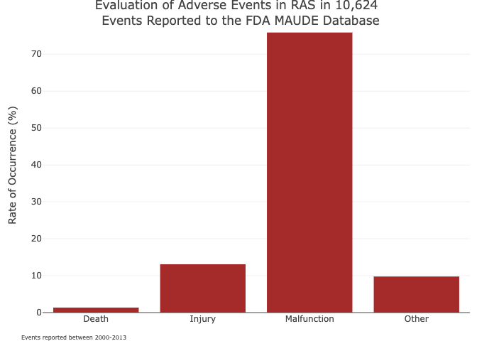

# Discussion

- Explain why I had trouble finding publically available sources, or at least that I did
- Explain that more publically available data is needed before we can have full adoption of RASDs
    - With American's views on AI in surgery, and the growing field, we need to close the gap between the two 

- Explain importance of error reporting 

## Why there is a lack of pubically available data

## Why does innovation still thrive 

-  think these last two points may be better off in the discussion section because although they are part of my research question, they will likely be postulation based on some theory of technology acceptance and research availability